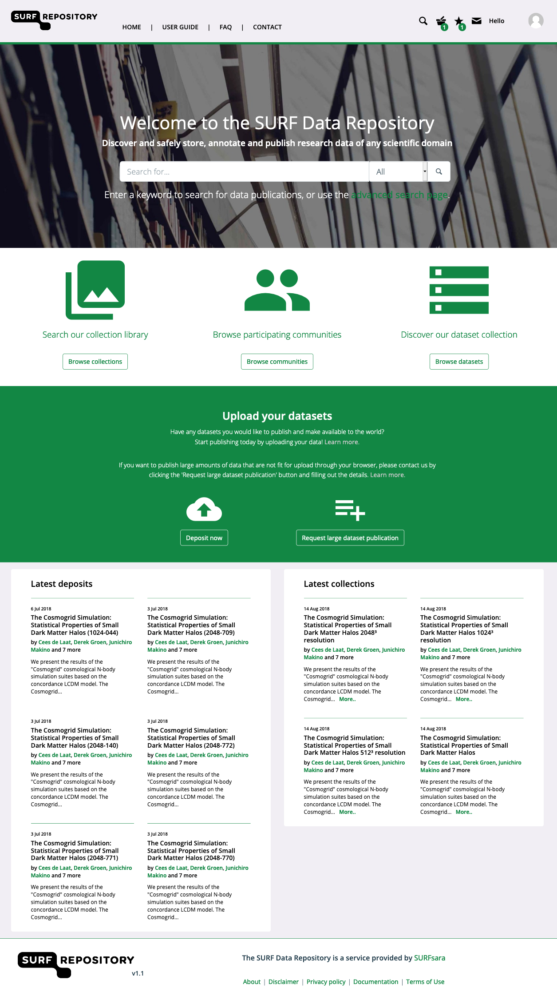
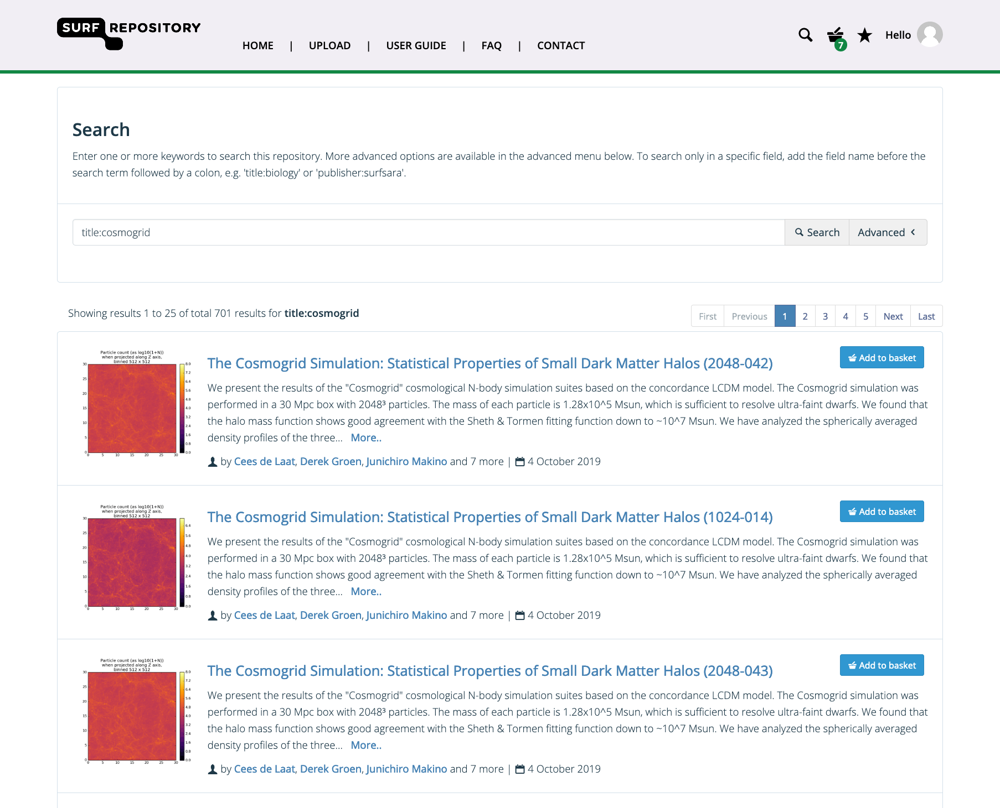
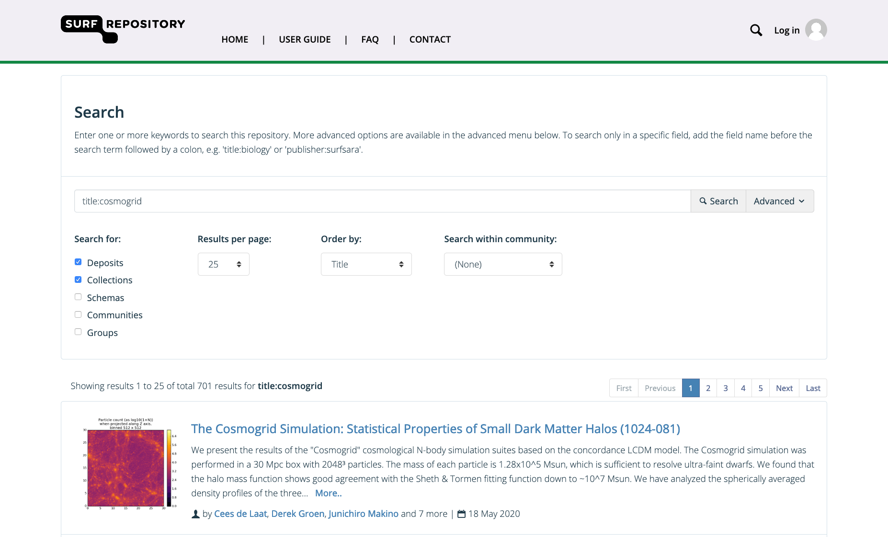
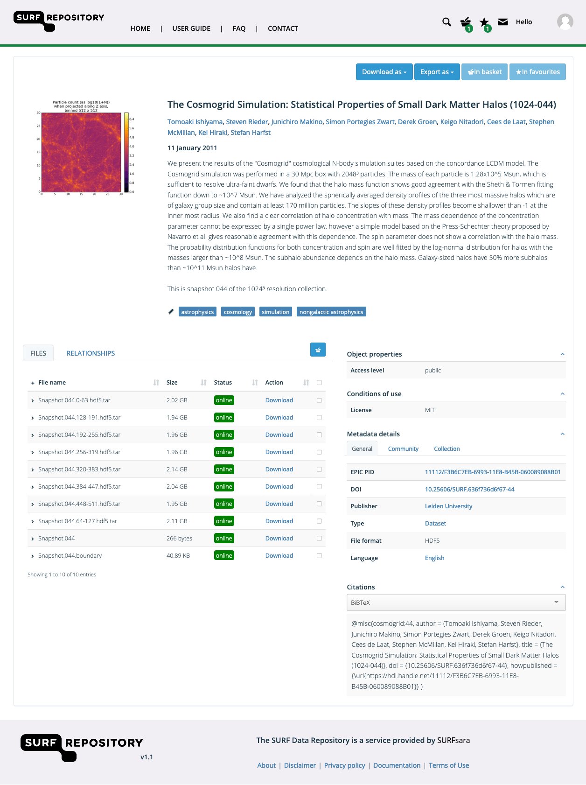
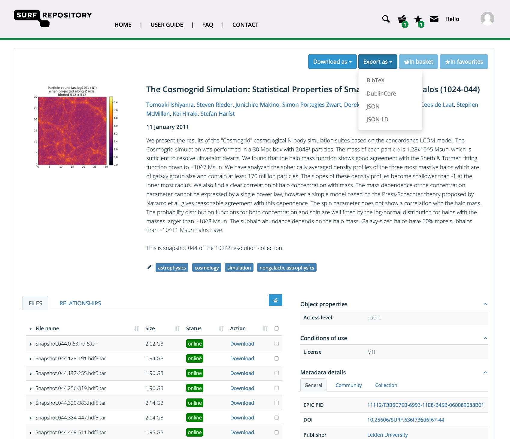
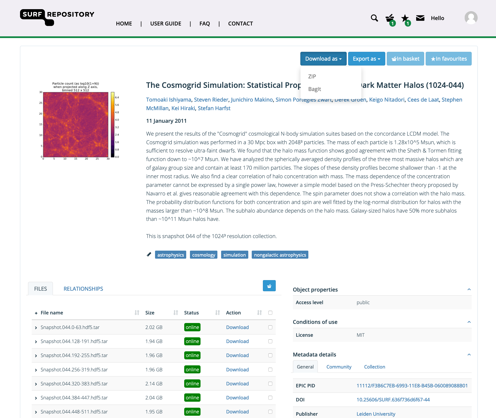
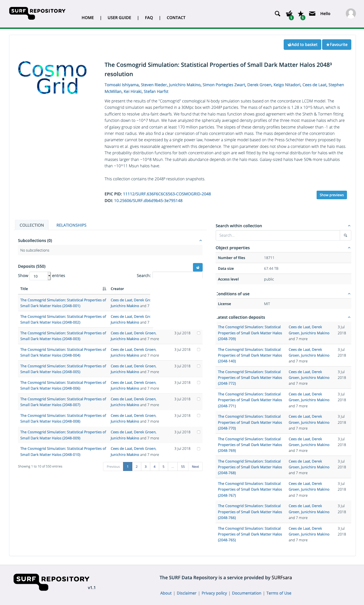

.. _basic-usage:

******************************
Navigating the Data Repository
******************************

The main goal of the SURF data repository is to make large datasets findable and accessible. This page provides information on the basic usage of the data repository, such as discovering, searching, and downloading data. For the majority of the functionality described on this page registration is not required.

.. contents:: Contents
    :depth: 2
    :local:

Homepage
========

.. sidebar::
   **Note:**

   **Deposit** is an object containing one or more files and corresponding metadata

   **Collection** is a bunch of deposits and/or collections and has metadata of its own

   **Community** is a group of common users that are part of a research domain or initiative

   See the :ref:`Objects reference <advanced-objects>` for more information on object types.

On the homepage you can quickly find the latest deposits and collections, start depositing your own data, or search for existing digital objects for download.

The search bar can be used to quickly find deposits and collections. It supports faceted search by prepending a field before your search term, for example *title:data*.

Clicking on the avatar in the top right corner presents you with a dropdown menu where you can locate your account details. The ``My account`` button sends you to your `account page`_. Here you can create and manage your deposits, collections, groups and, if allowed, communities and schemas. Please refer to the :ref:`Advanced usage <advanced-usage>` section of the documentation for more information.

.. _search-data:

Search and discover datasets
============================
Use the search functionality on the homepage to find datasets. Both registered and unregistered users can search for data. In the search bar you enter keywords to search for collections and deposits in the repository. These keywords can be any part of a title, keyword, abstract or any other metadata field. To search only in a specific field, add the field name before the search term followed by a colon, e.g. *title:biology* or *publisher:SURF*.

.. note:: If you have the PID (Persistent Identifier) of the data you can directly search in the `Handle Server`_ and get the URL to the location of the data.

To use the advanced search function, click on the search button on the homepage and expand the *Advanced* menu. The advanced search criteria can be used to search for specific objects like deposits, collections, schemas, communities, or a combination of objects. To search for datasets that belong to a specific community, you can select a relevant community using the *Search within community* menu.

.. note:: If you have the PID (Persistent Identifier) of the data you can directly search in the `Handle Server`_ and get the URL to the location of the data.

.. _deposit-landing-page:

Deposit landing page
====================
The landing page of a deposit is created after completion of the online deposit workflow. In the deposit landing page you can see the deposit's basic details, additional metadata and information about the status of the files in the deposit.

.. _export-metadata:

Export Metadata
---------------

To export metadata of an object go to the object's landing page and click the ``Export as`` button in the top-right corner of the page. There are different formats in which the metadata can be exported. The exact fields that are available in the export depend on the metadata schema of the deposit.

Download the deposit
--------------------

To download a single file of the deposit use the ``Download`` button in the files overview. A file can be *online* or *offline*. If a file is *online* it can be downloaded immediately. If a file is *offline* it needs to be staged before it is available for download. To stage a file, login to the data repository and click the ``Request`` button.

To download the entire deposit click the ``Download as`` button in the top right corner of the page. The deposit can be downloaded as ZIP archive or as a BagIt archive file. If not all files are *online* you will receive an error message. To resolve this please stage all files before retrying the operation.

.. _deposit-citations:

Deposit citations
-----------------

If you want to add a citation of the data set you can copy the provided text shown in the box at the bottom right in the right sidebar of the landing page. Click on the clipboard icon to copy the text to your clipboard.

Select a different citation style in the dropdown selection box to change it to the style you need.

.. _collection-landing-page:

Collection landing page
=======================
A landing page of a collection is similar to that of a deposit. In the collection landing page the basic details of the collection are listed, as well as all collections and deposits that are part of the collection. To export the metadata of a collection, click the ``Export as`` button in the top-right corner of the page. To download all data of a collection, please checkout the download instructions :ref:`here <download-script>`.

.. _collection-citations:

Collection citations
--------------------

If you want to add a citation of the collection you can copy the provided text shown in the box at the bottom right in the right sidebar of the landing page. Click on the clipboard icon to copy the text to your clipboard.

Select a different citation style in the dropdown selection box to change it to the style you need.

.. Links:

.. _`account page`: https://repository.surfsara.nl/user
.. _`Handle Server`: http://hdl.handle.net/
