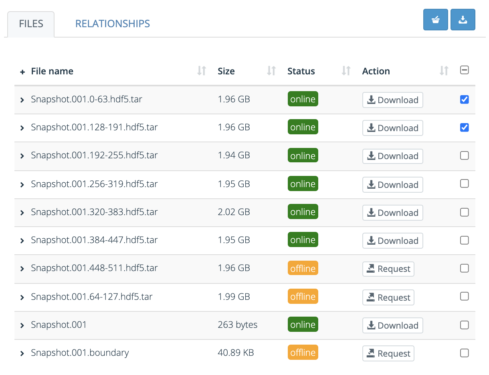

*********
Downloads
*********

This page provides information on downloading files from the Data Repository. There are two methods to get data out of the repository: download files directly from an object's landing page, or use a script to download multiple files or complete collections.

.. contents::
    :depth: 8

.. _downloads-landing:

Download files directly
=======================

To download files directly using the browser you need to navigate to the landing page of the deposit that contains the desired files. Unregistered users can only download files of objects that are publicly accessible and staged. Files of objects that are privately shared can only be downloaded by users that have explicit access to these objects. If an object's access level is set to registered, only registered and logged in users can access the files.

You can download single files by clicking the ``Download`` button next to the file. If the status of the file is offline, it means it cannot be downloaded directly. A file that is offline needs to be staged first, to stage the file click the ``Request`` button. Staging files is only available for registered users.

To download multiple files from the same deposit, select multiple files and use the "Download as zip" button to download the selection. This feature is available for registered users and works for online files only. If you want to bulk download multiple offline files, stage the files first or download the files using a script. See the next section for more information.

.. image:: ../img/deposit-landing-page-file-table.png
   :align: center
   :width: 75%
   :alt: File table for deposit landing pages

Download using a script
=======================

To download multiple deposits or entire collections, you can use the download script. The download script as provided by the Data Repository service is a tool that automatically downloads all objects and files in your basket or favourites.

Using the download script is a three step process:

1. Download, install, and configure the script.
2. Select the objects to download.
3. Run the download script.

Each of these steps is described in more detail below.

Install and configure the script
---------------------------------

The download script requires a Python 3 runtime. You can download Python executable from the `Python website`_. The script needs to be run using a terminal or command prompt (depending on the operating system you are using). If you are not familiar with the Linux or MacOS terminal, please refer to for example this `introductory tutorial`_ or for Windows, this `introduction to the Windows command prompt`_.

.. image:: ../img/account-basket.png
   :align: center
   :width: 90%
   :alt: Account basket

To acquire the script, login to the repository and go to the `basket menu`_ by clicking on your username in the top right corner and selecting basket in the menu on the left. Use the ``Download script`` button in the upper right corner to acquire the download script. To install the script unpack the ZIP file and install the requirements:

.. code-block:: bash

   cd /home/user/script-directory
   pip install -r requirements.txt

The script requires API access to download files. The script uses an access token that can be acquired through the API tokens tab on the account page. To create an API token go to the `API tokens tab`_ and create a new token by filling in a token name in the top right corner and clicking ``Add API token``. Copy the token and store it in a safe place. If the token is lost the old token can be removed and a new token can be generated via the API tokens tab.

.. image:: ../img/account-tokens.png
   :align: center
   :width: 90%
   :alt: Account favourites

Select objects for downloading
------------------------------

The download script can be used to download all deposits, files and collections that are in the basket or that are marked as favourite. You can add objects or files to your basket or favourites using the ``Add to basket`` or ``Favourite`` buttons in the top-right corner, or by selecting individual files in the files table and then clicking on the basket icon button directly above the table.

Downloading objects
-------------------

Once all the objects ade added to the basket or favourites, they can be downloaded using the script and API token from the first step. To download all items in your basket simply run:

.. code-block:: bash

   cd /home/user/script-directory
   ./repository-download.py <token>

Where ``<token>`` is the API token you acquired in step one. By default the download script will connect to https://repository.surfsara.nl. To connect to a different instance, for example the test instance, add a ``target`` parameter:

.. code-block:: bash

   ./repository-download.py --target https://tdr-test.surfsara.nl/ <token>

To download the all items from your favourites run:

.. code-block:: bash

   ./repository-download.py --favourites <token>

And for a full list of options and general usage instructions, please run:

.. code-block:: bash

   ./repository-download.py -h

.. Links:

.. _`Login`: https://repo-test.surfsara.nl/user/login
.. _`Handle Server`: http://hdl.handle.net/
.. _`Python website`: https://www.python.org
.. _`introductory tutorial`: https://computers.tutsplus.com/tutorials/navigating-the-terminal-a-gentle-introduction--mac-3855
.. _`introduction to the Windows command prompt`: https://www.bleepingcomputer.com/tutorials/windows-command-prompt-introduction
.. _`basket menu`: https://tdr-test.surfsara.nl/user#basket-tab\
.. _`API tokens tab`: https://tdr-test.surfsara.nl/user#tokens-tab
