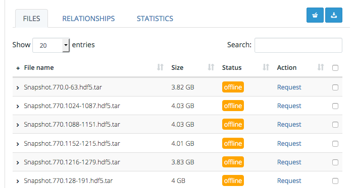
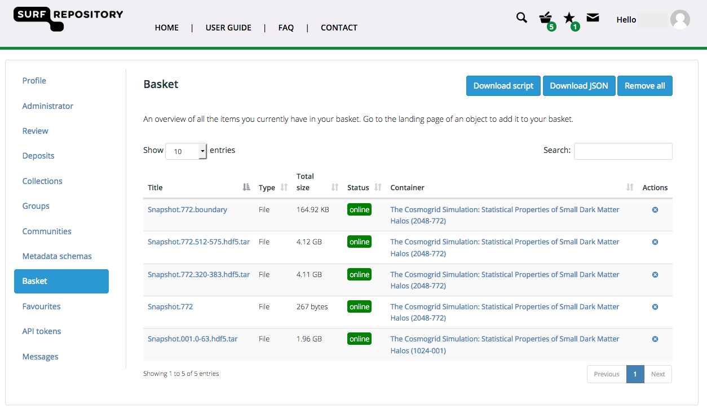
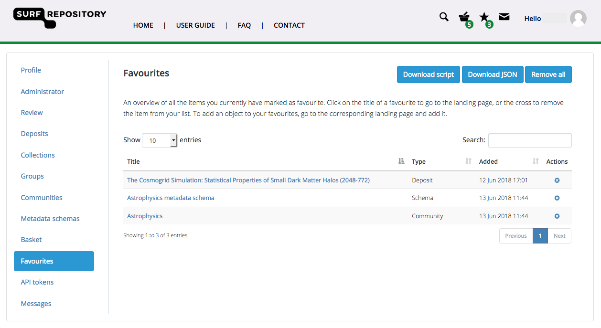
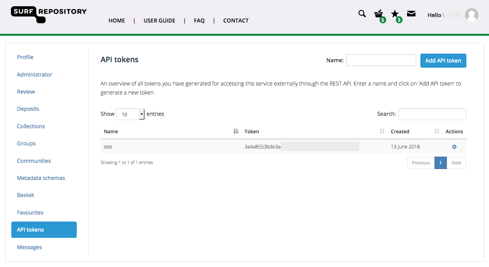

.. _downloads:

***********
Downloads
***********

This page provides information on downloading files from the Data Repository. There are two methods to get data out of the repository: download files directly from an object's landing page, or use the download script that allows downloads of multiple files or even complete deposits and collections selected in your basket or favourites.

.. contents::
    :depth: 8

.. _downloads-landing:

==========================
Download files directly
==========================

To download files directly from the Data Repository you need to navigate to the landing page of the deposit you want to download the files from. Unregistered users can only download files of objects that are publically accessible. Files of objects that are privately shared can only be downloaded by users that have explicit access to these objects. If an object's access level is set to registered, only registered and logged in users can access the files.

You can download single files by clicking on the **download** link next to the file name. If the status of the file is **offline**, it means it cannot be downloaded directly, but first needs to be staged. A request to stage the file can be made by clicking the **request** link.

.. _downloads-basket:

==========================
Adding objects or files to your basket
==========================

To download several files at the same time, your can add objects or files to your basket. This can be done by clicking on the 'Add to basket' button in the top-right corner, or by selecting individual files in the files table and then clicking on the basket icon button directly above the table.

Once you have selected all the objects and/or files you want, you can download them all at once using the download script provided by the repository. Go to your account page and select the basket tab to download the script by clicking on the 'Download script' button.

==========================
Adding objects to your favourites
==========================

You can add any object to your favourites by clicking on the 'Favourite' button in the top-right corner of the landing page of an object. Go to the favourites tab in your account overview to see the list of favourited items.

You can download all downloadable objects directly using the download script. Click on the 'Download script' button on the same tab to download the script.

.. _downloads-script:

================
Download script
================

The download script as provided by the Data Repository service is a tool that automatically downloads all objects and files in your basket or favourites. It is written in Python and therefore needs to have the Python runtime installed. You can download Python from its [website](https://www.python.org/).

The script needs to be run using a terminal or command prompt (depending on the operating system you are using). If you are not familiar with the Linux or MacOS terminal, please refer to for example this [introductory tutorial](https://computers.tutsplus.com/tutorials/navigating-the-terminal-a-gentle-introduction--mac-3855) or for Windows, this [introduction to the Windows command prompt](https://www.bleepingcomputer.com/tutorials/windows-command-prompt-introduction/).

Before you can start downloading using the script, you need to create an API access token that allows authentication through the service API using the tool. Go to the API tokens tab in your account page and click 'Add API token' after filling in a unique name for the token.

Copy the randomly generated token to your clipboard and add it after the script name's statement in your terminal or command prompt. When executing the tool will automatically download all files contained in the selected objects.

.. Links:

.. _`Login`: https://repo-test.surfsara.nl/user/login
.. _`Handle Server`: http://hdl.handle.net/