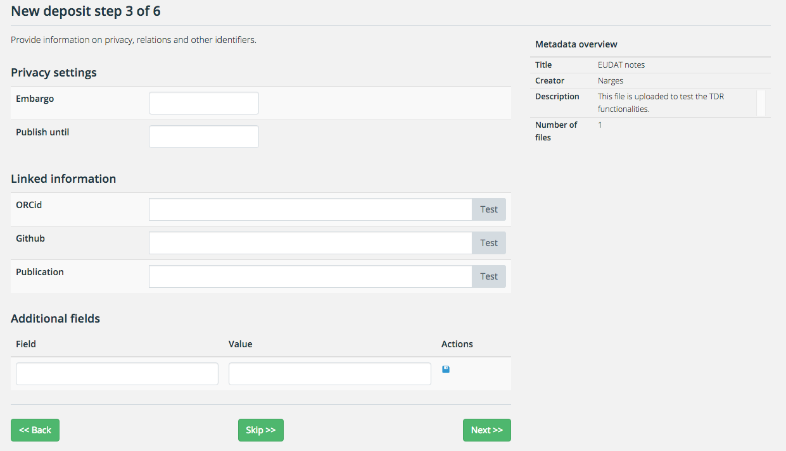
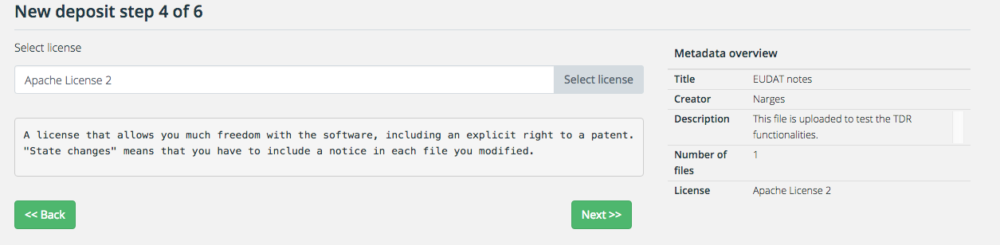
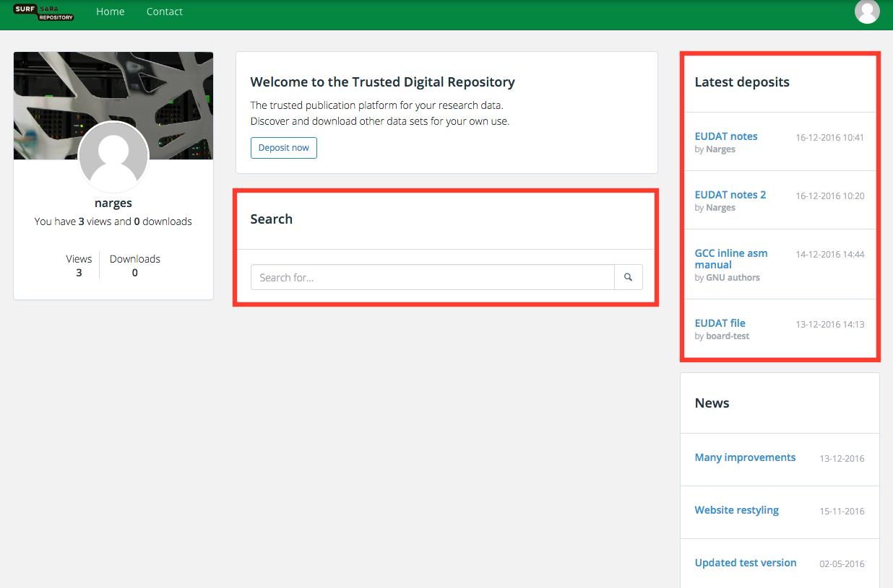

#TDR User Guide 
Trusted digital repository (TDR) is a service that provides an online data publication service to disclose and share research data from Big Data sciences. TDR ensures reliable and sustainable access to the data deposited. TDR service is certified by DSA (Data Seal of Approval).


##Basic Usage

###Registration 
To use the trusted digital repository you need to login as a registered user. You can register by creating your own account via the Login page, under the tab "Create new account". 

###Logging in
Login with the user credentials you have created.

###Preparing data 

To prepare data for a deposit you need to consider the following points:

- **File formats**
	- **Prefered formats** are file formats of which SURFsara is confident that they will offer the best long-term guarantees in terms of usability, accessibility and sustainability. Depositing research data in preferred formats will always be accepted by SURFsara. Here is a list with [SURFsara prefered formats] (http://datasupport.researchdata.nl/en/start-de-cursus/iii-onderzoeksfase/dataformaten/preferred-formats/)

	- **Acceptale formats** are file formats that are widely used in addition to the preferred formats, and which will be moderately to reasonably usable, accessible and robust in the long term. SURFsara favours the use of preferred formats, but acceptable formats will in most cases also be allowed. Here is a list with [SURFsara acceptable formats](http://datasupport.researchdata.nl/en/start-de-cursus/iii-onderzoeksfase/dataformaten/preferred-formats/)


- **Files size**
	- **Maximum file size**: Is there a maximum file size for depositing data?
	- **minimu file size**: Is there a minimum file size for depositing data.
- **Data documentation**

	Proper data documentation ensures that research data are traceable and unambiguously understood and used by current and future users (including the researcher). It is vital to store the data in a structured and consistent way with appropriate data documentation (metadata). Metadata is standardised structured information explaining the purpose, origin, time references, geographic location, creator, access conditions and terms of use of a data collection.
	
- **Data organisation**
	
	If you want your research data to be easily traced and interpreted, the folder structure and the file names used for the data files should be logical. Its also a good practice to note the file naming and its meaning in a readme.txt file.
 
- **Data anonymization**
Before you upload the files you should check whether they contain privacy-sensitive information within the meaning of the [Dutch Personal Data Protection Act] (http://www.coe.int/t/dghl/standardsetting/dataprotection/national%20laws/NL_DP_LAW.pdf). 
If you give access to the data, they must be completely anonimyzed. 


###Depositing data 

To deposite data, you should login as a registered user. In the main page click on "Deposit now". Depositing data in TDR is a 6 step process. 

*  **Step 1: Select and upload files to deposit**
	
	In this step you should provide the files and general information about your deposit. You first need to select t he files and then upload them. Make sure that you are uploading an acceptable file format and the file extention is valid (Valid file extentions are: .jpg, .jpeg, .gif, .png, .txt, .doc, .xls, .pdf, .ppt, .pps, .odt, .ods, .odp, .zip, .mp4, .avi).

	
	Then enter the general information that is required (Title, Creator and Description). These information will be the basic  metadata for the files. THe fields with * are compolsury.	
	
	 
	
* **Step 2: Select a community, collection and/or metadata schema**
	If you are a memeber of a community and you want to deposit data in that community, select the community name.
	The collection and metadata schema will be prepopulated based on which community you choose. 
	If you have a simple deposite and are not member of any communities you can skip this step.
	
	 

* **Step 3: Provide information on privacy, relations and other identifiers**
	
	In this step you can provide any privacy settings such as Embargo and Publish untill. You can also provide any linked information to the data. 
	If the data is not linked and has no privacy constrains you can skip this step.
	
	 
	
* **Step 4: Select license**
	
	In this step you can select a license for your data. Click on "Choose license" and a new page will be open.
	
	
	
	You can use the search to find the license. If you are not sure which license to choose, answer the questions on the top of the form to find the appropriate license.
	
	
	
	The license you choose will be added to the metadata overview.
	 
	 
* **Step 5: Terms of Use / Producer contract** 
	
	Please read the terms of use and agree with that before depositing data.
	
* **Step 6: Deposit overview**

	In this page you see the deposit overview. You can finalize the deposit by clicking the complete button.
	
	 
	

	
### Finding datasets
To find a data or metadata, use the search functionality on the home page. You can also see the latest deposits on the the top-right pannel in your homepage. 

  

If you have the PID (Persistent Identifer) of the data you can directly search in the [handle server](http://hdl.handle.net/) and get the url to the data.

###Exporting metadata
To export metadata you should first find the data and then click on the export link on the top-right op the metadata pannel. 


###Downloading files 
You can download single files by going to the data page, selecting the file and click on download. Or you can add more than one files to your backet and then download them once.


##Advanced Usage
- Metadata schema definition
- Community/group memberships
- Download basket (not in the first release)

##Payment

##FAQ

##Terms of Use

[Report The legal status of raw data: a guide for research practice ](https://www.surf.nl/en/knowledge-base/2009/report-the-legal-status-of-raw-data-a-guide-for-research-practice.html)

#Appendix

##Open adata
Simply making data available – providing access – is often not enough to be allowed to reuse data. The data has to be available in a format and under a license that allows reuse. 

A piece of data or content is open if anyone is free to use, reuse, and redistribute it — subject only, at most, to the requirement to attribute and/or share-alike. (see http://okfn.org/opendata/).

##Linked data
If, in addition, the data is also available in a linked data format, this results in new possibilities for use. Linked data have a certain structure(3) allowing for technical interoperability of datawsets. This way data from a variety of sources can be easily linked.  

##Data Provinance
Data provenance is providing a historical record of the data and its origins. It refers to the process of tracing and recording the origins of data and its movement between databases. (see http://db.cis.upenn.edu/DL/fsttcs.pdf).

## DOI
The digital object identifier is a unique and stable identifier that ensures that a digital object can be permanently found on the World Wide Web, regardless of changes in the URL where the object is found. A central registry ensures that the user of a DOI will be referred to its current location. (see e.g. http://www.datacite.org/). 

##Data seal of approval
An archive holding a Data Seal of Approval (DSA) complies with requirements ensuring that in the future, research data can still be processed in a high-quality and reliable manner. (see http://www.datasealofapproval.org). 

##Linked data
A term used to describe a recommended best practice for exposing, sharing, and connecting pieces of data, information and knowledge on the Semantic Web using RDF. Linked data refers to data published on the web in such a way that it is machine-readable, that its meaning is explicitly defined, that it is linked to other external data sets, and that in turn it can be linked to from external data sets. (see http://linkeddata.org).

##Metadata types
- Descriptive metadata	
The minimal metdata, required to find a digital object.  
If there are additional contextual metadata, a user will have a better idea on how to use the data
Author, title, abstract, date
- Contextuele metadata are for example location, time, data collection method (tools)
Structural metadata	
These link the individual objects of a unity
Links to related digital objects, (e.g. the article written based on the linked research data)
- Technical metadata	Information on the technical aspects of the data set	Data format, hardware/software used, calibration, version, authentication, encryption, metadata standard
- Administrative metadata	Metadata focusing on user rights and management of digital objects	
License, possible reasons for an embargo, waivers
Search logs, user tracking

##Persistent Identifiers
A unique code that is coupled to a digital object. With this code, the object can be identified even when the object is moved to a different location. The DOI and the URN:UBN are examples of persistent identifiers.